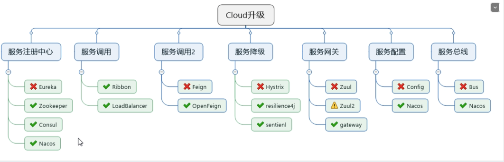

# 笔记

## springboot/springcloud版本选择

[spriing 和springcloud 之间的版本关系](https://spring.io/projects/spring-cloud#overview)

[更加详细的版本关系](https://start.spring.io/actuator/info)

## 技术选型


cloud Hoxton.SR1

boot 2.2.2 RELEASE

java 8

maven 3.5及以上

msql 5.7及以上

cloud 的组件选择




## IDEA 新建project工作空间

### 微服务cloud 整体聚合父工程project
> 重点： 约定>配置> 编码

1. NewProject 
2. 集合工程命名
3. maven 版本选择
    0. 修改idea 的maven 路径
    1. springcloud 的版本对maven 版本有要求，需要有对应关系
    2.  [maven的版本安装](https://blog.csdn.net/dearKundy/article/details/80291275)
        * 注意 仓库的路径 改为你所用的maven 下的仓库
    3. [IDEA中已配置阿里镜像，但maven无法下载jar包的问题](https://blog.csdn.net/HeyWeCome/article/details/104543411)
    4. [Maven中的dependencyManagement和dependencies](https://blog.csdn.net/vtopqx/article/details/79034835)
        * dependencyManagement里只是声明依赖，并不自动实现引入，需要子项目显示的声明需要依赖。提供了一种管理依赖版本号方式
        * 通常会在一个组织或项目的最顶层的父POM 中看到dependencyManagment 元素
        * 如果不在子项目中声明依赖，是不会从项目中继承下来的，只有在子项目中写了该依赖项，并没有指定具备版本， 才会从父项目中继承该项目，并且version 和scoke 都读取父pom
        * 子模块不用写groupId 和version
    5. 跳过单元测试
    6. 父工程创建完成执行mvn:install将父工程发布到仓库方便子工程继承
    
4. 工程名字
5. 字符编码

    `Edit- Fil Encoding- global Encoding UTF8 ,project Encoding,Default Econding for properties for utf8, 勾选 trcmsparent native-to acill`
6. 注解生效

    `Build-compiler-AnnotationProcessors-default-  勾选Enabble annotation proesssing`
    
7. java 编译版本选择8

    `Build-compiler-java Compiler-version8`

8. 修改pom 文件 打包类型为 pom

9. 插件lookmok

## 微服务模块

1 建设module
    *  新建模块工程， 父pome已经多了<module>
2 改写Pom.xml
3 写YML
4 启动类
5 业务类
    (原始的写业务方法)
   * 建表
   * entities
        *  JSON 封装体CommonResult
   * dao
      * PaymentDao
      * mybaits的映射文件 PaymentMapper.xml
         
   * service
   
   * controller

6 热部署 （代码改动，可以自动重启,注意应当在发布环境下注释掉该功能） 
  * `adding devtools to your project`
  在子项目中
   ```xml
   <dependency>
     <groupId>org.springframework.boot</groupId>
     <artifactId>spring-boot-devtools</artifactId>
     <scope>runtime</scope>
     <optional>true</optional>
</dependency>
   
   ```
  * `Adding plugin to your pom.xml`
  在聚合类父工程pom.xml 中添加
  ```xml
 <build>
        <plugins>
            <plugin>
                <groupId>org.springframework.boot</groupId>
                <artifactId>spring-boot-maven-plugin</artifactId>
                <configuration>
                    <fork>true</fork>
                    <addResources>true</addResources>
                </configuration>
            </plugin>
        </plugins>
    </build>
```
  * `Endling automatic build`
  
    `Build-> complier-> Automaticall Display  Build  Compile 打钩`
  
  * Update the value of
  
    快捷键 `com + shift + opt + /`  然后选择 Registry, compiler.automake.allow.when.app.runing，actionSystem.assertFocusAccessFromEdt 打钩
    
  * 重启IDEA

## 工程重构

当提取重复的项目，的时候可以执行

`maven clean ` 和 `maven instll`

```xml
<groupId> 域名（是聚合pom 里面的名字）</groupId>
<artifactId>项目名字</artifactId>
```


            当optional为true则说明该依赖禁止依赖传递
            <optional>true</optional>

## Eureka 服务注册和发现

### Eureka 服务治理

什么是服务治理

在传统的rpc 远程调用框架中，管理每个服务于服务之间依赖关系比较复杂，管理比较复杂，所以需要使用服务治理，管理服务和服务之前的关系，可以实现服务调用，负载均衡，实现服务的发现和注册

什么是服务注册于发现

Eureka 采用了CS 的设计架构，Eureka Server 作为服务注册功能的服务器，他是服务注册中心，而系统中的其他微服务，使用Eureka 的客户端连接到Eureka srver
并维持心跳连接，这样系统的维护人员就可以通过Eureka Server来监控系统中各个微服务是否正常运行

在服务注册于发现中，有一个注册中心，当服务器启动的是否，会把当前自己服务器的信息，比如服务地址等别名方式注册到中心上，另一方（消费者） 以该别名的方式去注册中心
上获取到实际的拂去通信地址，让后再实现本地RPC 调用RPC 远程调用框架核心设计思想，在于注册中心，因为使用注册中心管理每个服务于服务质检的一个依赖关系

Eureka 的两个组件
 
1. Eureka Server 提供服务注册服务

各个微服务节点通过配置启动后，会在EurekaServer 中进行注册，这样EurekaServer 中的服务注册表中将会存储所有可用服务节点的信息，服务节点的信息可以界面中观察看到

2. EurekaClient 通过注册中心进行访问

是一个java 客户端， 用于简化Eureka Server 的交互，客户端同事也具备一个内置的，使用轮训负载算法的负载均衡器，在应用启动后，将会向EurekaServer发心跳，如果EurekaServer 在多个心跳周期没有接受
到某个节点的心跳，EurekaServer 将会从服务器注册表中把这个节点移除

### 标志服

@EnableEurekaClient 是server， 建议使用新版本
```xml
eureka:
  instance:
    #eureka服务端的实例名称
    hostname: localhost
  client:
    #false表示不向注册中心注册自己
    register-with-eureka: false
    #false表示自己端就是注册中心,职责是维护实例,并不需要检索服务
    fetch-registry: false
    service-url:
      #设置与Eureka Server 交互的地址查询服务和注册服务都需要依赖这个地址
      defaultZone: http://${eureka.instance.hostname}:${server.port}/eureka/
#      defaultZone: http://eureka7002.com:7002/eureka/  #集群指向其他eureka
  server:
    # 关闭自我保护机制，保证不可用服务被及时剔除.默认开启保护机制 true
    enable-self-preservation: false
    eviction-interval-timer-in-ms: 2000
```

@EnableEurekaClient
```xml
eureka:
  client:
    #是否将自己注册到注册中心, 默认true
    register-with-eureka: true
    #是否从EurekaServer抓取已有的注册信息,单机无所谓,集群必须设置为true配合ribbon使用负载均衡
    fetch-registry: true
    service-url:
      #      defaultZone: http://localhost:7001/eureka  #单机版
      defaultZone: http://eureka7001.com:7001/eureka,http://eureka7002.com:7002/eureka  #集群版
  instance:
    instance-id: payment8001
    #访问路径可以显示IP地址
    prefer-ip-address: true
    #Eureka客户端向服务端发送心跳的时间间隔.单位为秒(默认30 秒)
    lease-renewal-interval-in-seconds: 1
    #Eureka服务端在收到最后一次心跳等待时间上限.单位为秒(默认90 秒),超时将剔除服务
    lease-expiration-duration-in-seconds: 2
```

### 集群 （略）

p19-46 没有看


### Hystrix 断路器（暂时放弃）

分布式系统面临的问题

服务雪崩

多个微服务之间调用的时候， 假设微服务A调用微服务B和微服务C ，B和C 同时在调用其他的微服务，这就是所谓的 "扇出"。如果扇出的链路上某个微服务的调用时间过长或者不可用，对微服务A的调用就会占用越来越多的系统资源，进而引起系统崩溃，所谓的雪崩效应

对于高流量的应用来说，单一的后端依赖可能导致所有服务器上的所有资源都在几秒钟饱和。比失败更糟糕的是这些应用程序还很坑导致服务之间的延迟增加，备份队列，线程和其他系统资源紧张，导致整个系统发生更多的联级故障，这些都表示需要对故障和延迟进行隔离和管理，
以便单个依赖失败，不能取消整个应用程序或系统。

所以 通常当你发现一个模块下的某个实例失败后，这时候这个模块还能接受流量，然后这个有问题的模块还调用了其他的模块，这样就会发生联级故障，或者叫雪崩

Hystrix 是一个用于处理分布式系统的延迟和容错的开源库，在分布式系统里面，许多依赖不可避免的会调用失败，比如超时，异常等等。Hystrix 能够保证在一个依赖出问题的情况下，不会呆滞整体服务失败，避免联级故障， 以提高分布式系统的弹性

"断路器"本身是一种开关装置，当某个服务单元发生故障以后，通过断路器的故障监控，向方向返回一个符合预期的，可处理的备选响应（FallBack）,而不是长期的等待或者跑出调用方法无法处理的异常，这样就保证了服务调用方的线程不会被长时间，不必要的占用
，从而避免了故障在分布式系统中的蔓延，乃至雪崩
[B 站](https://www.bilibili.com/video/BV18E411x7eT?p=74)